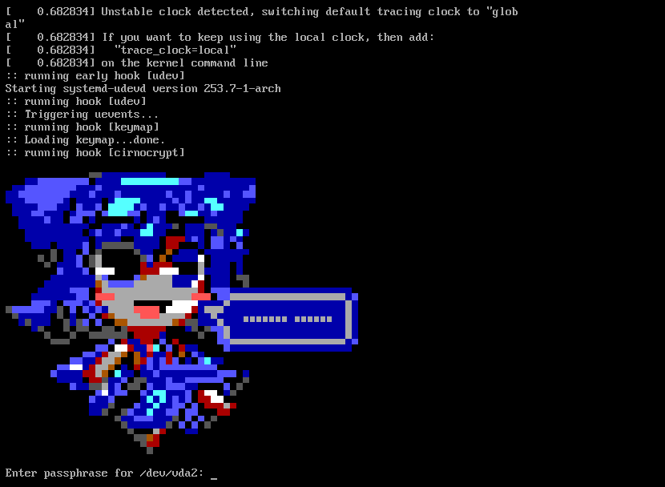

# cirnocrypt
Change boring partition decrypt text to ascii cirno greeting  

###### Only for ArchLinux with mkinitcpio for now

## Installing
- `git clone https://github.com/6yntar05/cirnocrypt`
- `cd cirnocrypt`
- `sudo sh install.sh`

## Uninstalling
  - `sudo cp backup/etc/mkinitcpio.conf /etc/mkinitcpio.conf`
      OR
  - Replace "cirnocrypt" hook to "encrypt" in /etc/mkinitcpio.conf manually
- `sudo mkinitcpio -P`